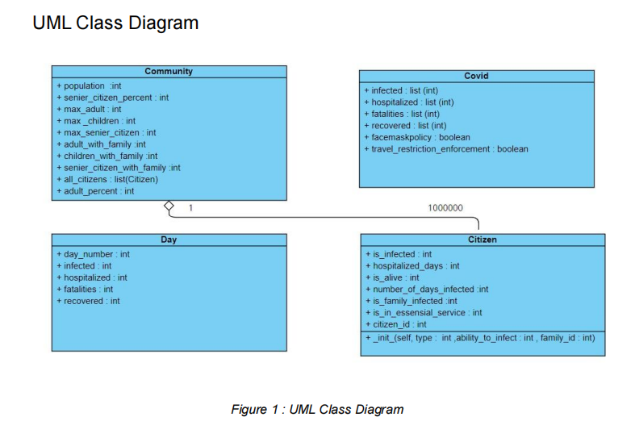

# Simulating COVID-19 spread in a conceptual community
A simulation programme using Python with object oriented design to analyze the spread of the COVID-19 virus in a conceptual community with a population of one million.

